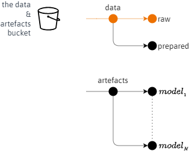

 

## RAW

This repository's image:

* Deletes all the contents of an Amazon S3 (Simple Storage Service) bucket.  
* Re-acquires the project's raw data, and delivers it to a raw data partition; orange path.

 

    

 
 

The bucket is split into <i>data</i> & <i>artefacts</i> partitions.  The artefacts partition is for storing model artefacts; the <a href="https://github.com/membranes/text" target="_blank">text</a> repository focuses on modelling.

 

### Data Snippet

For more about the POS (parts of speech) classes read [Tree Syntax of Natural Language](https://www.cs.cornell.edu/courses/cs474/2004fa/lec1.pdf).  A note about this data's tags is [here](https://theartificialintelligenceunit.github.io/intelligence/html/c-dispatches-data-profiles.html).

 

| Sentence #    | Word           | POS  | Tag   |
|:--------------|:---------------|:-----|:------|
| &nbsp; | &nbsp; &nbsp; $\vdots$            | &nbsp; $\vdots$   | $\vdots$     |
| Sentence: 461 | The            | DT   | O     |
| &nbsp;        | report         | NN   | O     |
| &nbsp;        | said           | VBD  | O     |
| &nbsp;        | the            | DT   | O     |
| &nbsp;        | ancient        | JJ   | O     |
| &nbsp;        | communities    | NNS  | O     |
| &nbsp;        | were           | VBD  | O     |
| &nbsp;        | discovered     | VBN  | O     |
| &nbsp;        | in             | IN   | O     |
| &nbsp;        | the            | DT   | O     |
| &nbsp;        | northern       | JJ   | O     |
| &nbsp;        | part           | NN   | O     |
| &nbsp;        | of             | IN   | O     |
| &nbsp;        | Shaanxi        | NNP  | B-geo |
| &nbsp;        | province       | NN   | O     |
| &nbsp;        | ,              | ,    | O     |
| &nbsp;        | a              | DT   | O     |
| &nbsp;        | region         | NN   | O     |
| &nbsp;        | known          | VBN  | O     |
| &nbsp;        | for            | IN   | O     |
| &nbsp;        | its            | PRP$ | O     |
| &nbsp;        | archaeological | JJ   | O     |
| &nbsp;        | treasures      | NNS  | O     |
| &nbsp;        | 0              | 0    | O     |
| Sentence: 462 | Xinhua         | NNP  | B-org |
| &nbsp;        | says           | VBZ  | O     |
| &nbsp;        | the            | DT   | O     |
| &nbsp;        | ruins          | NNS  | O     |
| &nbsp;        | show           | VBP  | O     |

 
 

 
 

 
 

 
 
